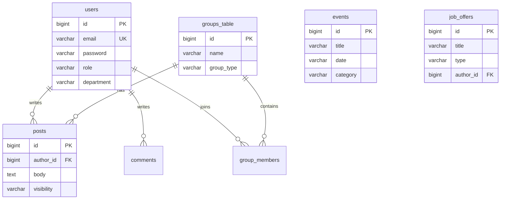

# Architecture — ENICAR Connect

This document outlines the core system design, components, and Entity-Relationship diagram for the ENICAR Connect platform.

## 1. System Architecture

ENICAR Connect follows a standard three-tier architecture containerized via Docker for reliable execution across environments.

```mermaid
graph TD
    %% Clients
    Client[Web Browser / PWA<br><b>Angular</b>]
    
    %% API Gateway / Proxy
    NGINX[Reverse Proxy<br><b>NGINX (Port 80/4200)</b>]
    
    %% Backend
    Spring[Backend Application<br><b>Spring Boot</b>]
    
    %% Database
    PG[(<b>PostgreSQL 15</b><br>enicar_db)]
    
    %% Connections
    Client -->|HTTP/REST| NGINX
    Client -->|WebSocket/STOMP| NGINX
    NGINX -->|/api/*| Spring
    Spring -->|JDBC| PG
```

## 2. Entity Relationship Diagram (v1.0)

The persistence layer is managed by PostgreSQL. Schema migrations are managed directly by Flyway (`db/migration/V1__init_schema.sql`), with Spring Data JPA/Hibernate asserting programmatic validation instead of automatic DDL generation.



## 3. Technology Stack Selection

### Frontend
- **Angular 17:** Selected for robust two-way data binding, dependency injection, and native TypeScript support.
- **Tailwind CSS:** Utility-first CSS framework establishing the unified *Navy/Gold* thematic design system.

### Backend
- **Java 17 & Spring Boot 3:** Enterprise-grade REST capabilities and automatic configuration.
- **Spring Security & JWT:** Stateless authentication scaling efficiently without server-side HTTP session overhead.
- **Lombok:** Boilerplate reduction for DTOs and Entities.

### Infrastructure & CI/CD
- **Docker & Docker Compose:** Container orchestration.
- **Flyway:** SQL-based database schema tracking.
- **Nginx:** Handles static payload serving and internal API proxying, preventing CORS complexities.
