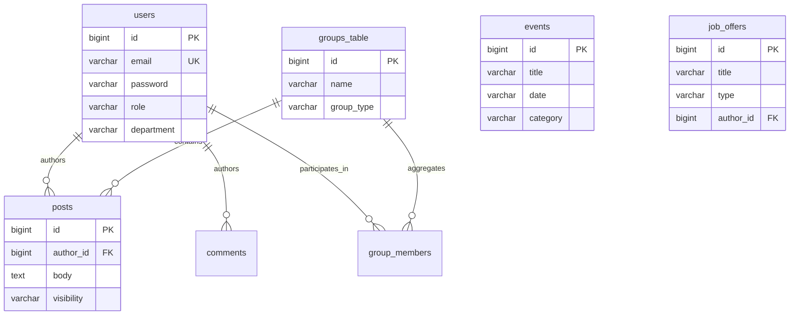

# Technical Design Document (TDD): ENICAR Connect

## 1. System Overview
ENICAR Connect is a centralized, digital community ecosystem engineered for the École Nationale d'Ingénieurs de Carthage (ENI Carthage). The platform consolidates disparate communication pipelines and administrative workflows into a unified, highly available web application. Operating on an enterprise-grade technology stack, the system is architected to deliver real-time social interactions, professional networking constructs, and robust administrative utilities while emphasizing scalability, security, and maintainability.

## 2. High-Level Architecture
The system adopts an API-centric, single-page application (SPA) monolith pattern, decoupled logically but orchestrated collectively via a unified Maven build lifecycle. The application abstracts complexities through a containerized Spring Boot backend serving both the RESTful API boundaries and the compiled Angular application assets natively.

```mermaid
graph TD
    %% Client Tier
    Client["Client Tier<br><b>Web Browser / PWA (Angular)</b>"]
    
    %% Compute Tier
    subgraph Compute Tier [Application Runtime Environment - Docker]
        Spring["Application Server<br><b>Java 17 / Spring Boot 3</b>"]
        SpaFilter["Web Filter<br><b>SPA Request Dispatcher</b>"]
    end
    
    %% Persistence Tier
    PG["Relational Data Store<br><b>PostgreSQL 15</b>"]
    
    %% Data Flow
    Client -->|HTTP/REST (TLS)| Spring
    Client -->|WebSocket (STOMP)| Spring
    Spring -->|Internal Route| SpaFilter
    SpaFilter -->|Fallback Resolve| Client
    Spring -->|JDBC/Hibernate| PG
```

## 3. Component Design
The system is partitioned into the following foundational components:

### 3.1 Client Tier (Presentation Layer)
- **Framework:** Angular 17+ leveraging TypeScript for rigorous type safety.
- **State & Reactivity:** RxJS streams handle asynchronous event propagation and state derivation.
- **Styling:** Tailwind CSS dictates the atomic, utility-driven design systemic language, strictly adhering to the institutional brand guidelines.

### 3.2 Compute Tier (Business Logic Layer)
- **Framework:** Java 17 operating on the Spring Boot 3.x ecosystem.
- **Security Context:** Spring Security enforces stateless authentication utilizing JSON Web Tokens (JWT). Authorization is governed stringently by Role-Based Access Control (RBAC).
- **Concurrency & Real-Time:** WebSocket connections managed via STOMP protocols facilitate instantaneous payload delivery for chat messaging and immediate push notifications.

### 3.3 Persistence Tier (Data Layer)
- **Primary Store:** PostgreSQL 15, optimized for relational integrity and heavy read/write concurrency.
- **Schema Lifecycle:** Flyway acts as the authoritative mechanism for deterministic database migrations, superseding Hibernate's auto-DDL configurations to ensure predictable, non-destructive staging and production deployments.

### 3.4 Logical Data Model (Core Bounded Contexts)


## 4. Data Flow
1. **Authentication:** A client transmits credentials via a secure HTTP payload. The Compute Tier validates the credentials against persistent records, dynamically generates a cryptographically signed JWT, and returns the token instance.
2. **Synchronous Interrogation:** The Client Tier injects the JWT into the `Authorization: Bearer` header. The Compute Tier intercepts the request, verifies the signature cryptography and temporal validity, asserts RBAC policies, processes the domain logic, and returns serialized JSON representations.
3. **Asynchronous Real-Time Subscriptions:** The Client Tier negotiates a WebSocket upgrade upgrade handshake. Upon stabilization, it subscribes to topic-specific channels (e.g., `/topic/messages`). The Compute Tier pushes localized permutations downstream asynchronously without requiring long-polling heuristics.
4. **Static Asset Resolution:** Upon a deep-linked navigation request that terminates outside recognized API patterns, the `SpaWebFilter` intercepts the network request and safely forwards the pipeline to `index.html`, ceding routing execution contexts locally to the Angular routing engine.

## 5. Trade-offs
- **Monolithic Orchestration vs. Microservices:** The ecosystem integrates the localized frontend repository directly into the backend Maven lifecycle. *Trade-off:* This significantly decreases CI/CD orchestration complexity and network hop latencies at the cost of tying frontend update deployments strictly to backend releases. Execution velocity fundamentally outweighs the theoretical benefits of independent micro-deployments at this lifecycle stage.
- **Stateless JWT vs. Stateful Sessions:** *Trade-off:* While stateless JWTs inherently scale horizontally across multiple instances without requiring sticky sessions or distributed caches (like Redis), they introduce rigid complexities regarding preemptive token revocation. A localized, short-lived token lifecycle strategy mitigates hijacking risks adequately without inflating persistence overhead.
- **Relational Integrity vs. NoSQL Agility:** The application enforces stringent data consistency structures through PostgreSQL. *Trade-off:* Relational mappings mandate explicit schema migrations (`Flyway`) and ORM parsing overhead, marginally reducing development agility. However, the hard requirement for robust transactional integrity across heavily associated entities (spanning user metrics, RBAC groups, and cascading entity deletions) critically necessitates an ACID-compliant RDBMS framework.
