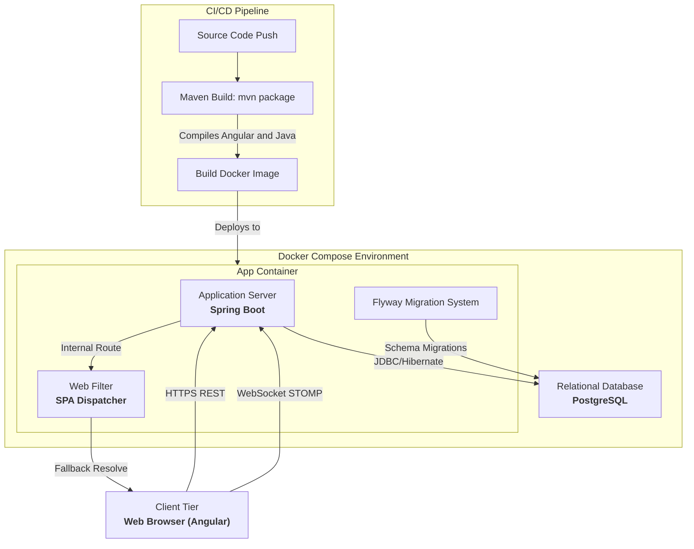
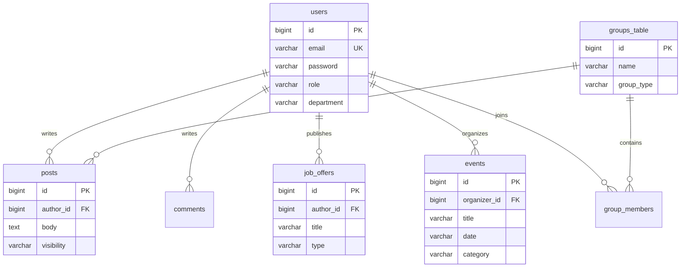

# Technical Design Document: ENICAR Connect

**Date:** April 2026  
**Authors:** [Author Name Placeholder]

## Table of Contents
1. [System Overview](#1-system-overview)
2. [High-Level Architecture](#2-high-level-architecture)
3. [Technology Stack](#3-technology-stack)
4. [Component Design](#4-component-design)
5. [Data Model](#5-data-model)
6. [Data Flow](#6-data-flow)
7. [Deployment Architecture](#7-deployment-architecture)
8. [REST API Contract](#8-rest-api-contract)
9. [Security Architecture](#9-security-architecture)
10. [Non-Functional Requirements](#10-non-functional-requirements)
11. [Trade-offs](#11-trade-offs)
12. [Contributing](#12-contributing)
13. [License](#13-license)

## 1. System Overview
ENICAR Connect is a centralized digital community platform for the École Nationale d'Ingénieurs de Carthage (ENI Carthage). It unifies scattered communication channels and digitizes administrative workflows. The platform provides internal social networking, professional mentoring, and utility services in a highly available, secure, and maintainable ecosystem.

## 2. High-Level Architecture
The system uses an API-centric, single-page application (SPA) monolith pattern. The Angular frontend is built via Maven and embedded into a Spring Boot application, simplifying deployment and eliminating CORS issues.

## 3. Technology Stack

| Technology | Version | Purpose |
|------------|---------|---------|
| Java | 17 | Core backend runtime. |
| Spring Boot | 3.x | Backend framework for REST APIs, Security, and DI. |
| Angular | 17+ | Frontend SPA framework. |
| PostgreSQL | 15 | Primary relational database for all persistent state. |
| STOMP/WebSockets | N/A | Real-time bi-directional messaging and notifications. |
| Flyway | 9.22+ | Database migration and schema version control. |
| Docker & Compose | 24+ | Containerization and local/production orchestration. |
| Tailwind CSS | 3.x | Utility-first styling framework. |

## 4. Component Design

### 4.1 Client Tier
- **Framework:** Angular 17+ providing a modular UI.
- **State Management:** RxJS streams handle asynchronous state capabilities and real-time updates.
- **Styling:** Tailwind CSS enforces a consistent design system aligned with ENICAR brand guidelines.

### 4.2 Compute Tier
- **Framework:** Java 17 and Spring Boot.
- **Security:** Spring Security manages stateless authentication via JWTs. Role-Based Access Control (RBAC) securely scopes resource access.
- **Real-Time Messaging:** Spring's WebSocket support with STOMP enabling low-latency chat messaging and live notifications.

### 4.3 Persistence Tier
- **Database:** PostgreSQL ensures absolute transactional integrity.
- **Migrations:** Flyway executes deterministic SQL scripts to reliably mutate the database schema on boot.

## 5. Data Model

## 6. Data Flow
1. **Authentication:** Clients perform an HTTP POST with credentials. The backend verifies credentials against PostgreSQL, generates a signed JWT, and returns it.
2. **Synchronous Requests:** Clients attach the JWT in the `Authorization: Bearer` header. The backend validates the signature, applies RBAC policies, processes the business logic, and responds with JSON.
3. **Asynchronous Subscriptions:** Clients initiate a WebSocket handshake. Once connected, they subscribe to STOMP topics (e.g., `/topic/messages`). The server pushes targeted asynchronous events to subscribed clients.
4. **Asset Resolution:** If a client requests a URL outside defined API paths, the `SpaWebFilter` forwards the request to `index.html`, allowing Angular to handle client-side routing.

## 7. Deployment Architecture
The application runs as a fully containerized monolith orchestrated via Docker Compose.

- **App Container:** Built using an Eclipse Temurin Java 17 image. It serves the REST API, the WebSocket connections, and statically serves the Angular SPA output. It connects directly to PostgreSQL. Exposed on port `8081`.
- **Database Container:** Runs PostgreSQL 15 alpine. Data persistence is managed via mapped Docker volumes. Exposed on port `5432`.
- **Environment Variables:** Credentials and paths are injected dynamically. Key examples: `DB_URL`, `DB_USERNAME`, `DB_PASSWORD`, `JWT_SECRET`.

## 8. REST API Contract
The system exposes a comprehensive JSON HTTP API. Below are 8 critical endpoints:

| Method | Path | Roles Allowed | Description |
|---|---|---|---|
| POST | `/api/auth/login` | Public | Authenticates user credentials and returns a JWT. |
| POST | `/api/auth/register` | Public | Registers a new student, alumni, or staff member. |
| GET | `/api/posts` | USER, ADMIN | Retrieves a paginated list of feed posts. |
| POST | `/api/posts` | USER, ADMIN | Creates a new post in the public feed. |
| GET | `/api/users/profile` | USER, ADMIN | Returns the detailed CV profile of the authenticated user. |
| GET | `/api/jobs` | USER, ADMIN | Fetches active internships and job postings. |
| POST | `/api/events` | ADMIN | Creates a new ENICAR event on the calendar. |
| GET | `/api/groups/{id}/members` | USER, ADMIN | Lists all members associated with a given group. |

## 9. Security Architecture
- **JWT Lifecycle:** Upon successful login, the server issues an asymmetric/symmetric signed JWT (HS256). The token holds a short expiry (e.g., 24 hours). The server validates the token on every restricted request. Revocation is handled implicitly via expiry.
- **RBAC Matrix:**
  - `STUDENT`: Base access to feed, messaging, and querying jobs.
  - `ALUMNI`: Can post jobs, act as a mentor, interact with students.
  - `ADMIN`: Full access to group deletion, event creation, and user management.
- **CORS Policy:** Native CORS complexities are entirely avoided due to the unified deployment model (Spring Boot serves the UI on the exact same domain origin).

## 10. Non-Functional Requirements
- **Performance:** Target P95 sub-500ms API response time. All pagination is cursor or offset-based to optimize DB lookups constraint.
- **Scalability:** The Java application is stateless (no server-side HTTP Sessions). It supports horizontal scaling across multiple load-balanced instances via Docker Swarm/Kubernetes natively.
- **Availability:** Engineered for 99.9% uptime reliant on container orchestrator restart policies.
- **Logging/Monitoring:** Spring Boot SLF4J logs structured data output straight to container `stdout`.

## 11. Trade-offs
- **Monolith vs. Microservices:** Combining Angular into the Maven build provides massive CI/CD velocity and reduces architectural sprawl, at the cost of tying frontend updates directly to backend deployments.
- **Stateless JWT vs. Sessions:** JWTs support easy scale-out since servers maintain no memory context. The trade-off is the inability to forcefully revoke tokens immediately before natural expiration without utilizing a secondary database blocklist.
- **RDBMS vs. NoSQL:** PostgreSQL strictly manages relationships between users, groups, and academic records. This sacrifices some schema agility but guarantees absolute data integrity, critical for academic platforms.

## 12. Contributing
Please review our internal contributing guidelines before submitting Pull Requests. Ensure all feature additions include appropriate `spring-security-test` contexts and Jasmine frontend specs. Follow the Git Flow branching model.

## 13. License
[License Placeholder - e.g., MIT License]
